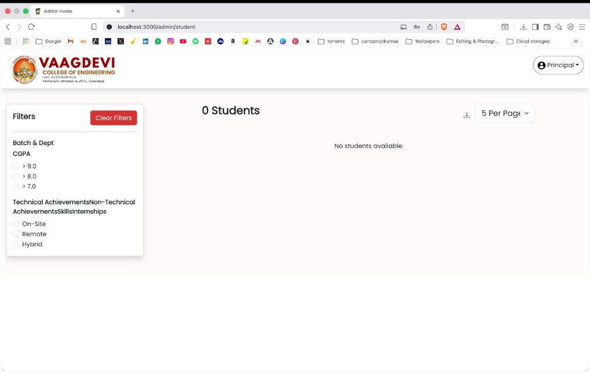
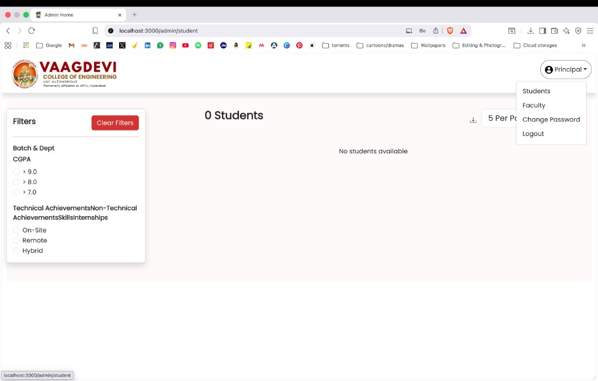
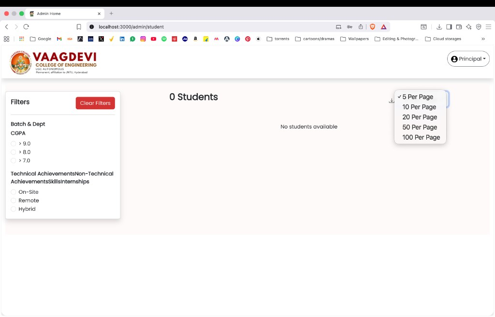
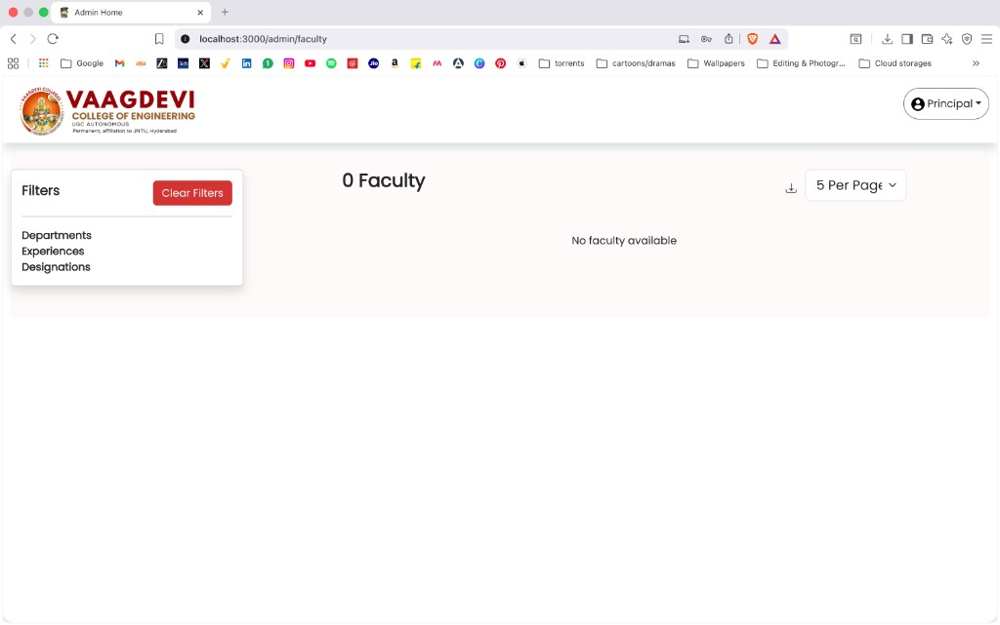
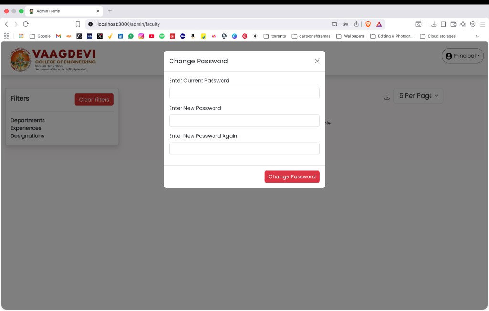
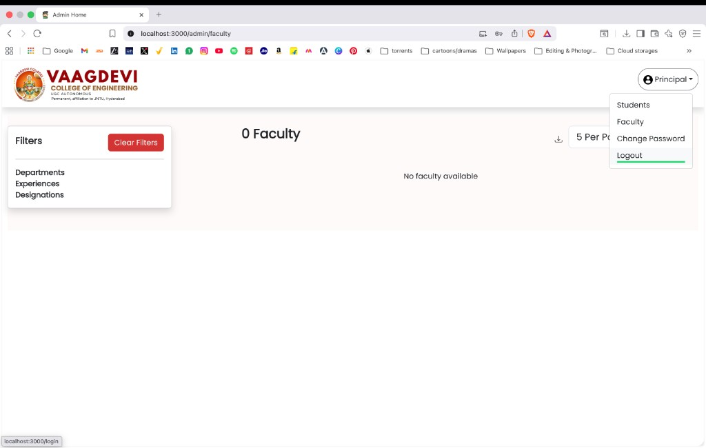

# Institutional Data Center

A university-grade centralized data management platform for Vaagdevi College of Engineering, built with a modern React + Spring Boot stack.  
The system manages student, faculty, and administrative operations with JWT security, role-based access, analytics, approvals workflow, and Excel exports.

## Highlights

- Production-ready full stack architecture (React 19 + Vite, Spring Boot 4, MySQL)
- Secure authentication and authorization with JWT + Spring Security
- Role-driven UX for Student, Faculty, and Admin users
- Admin control center with CRUD operations, analytics, and approval workflow
- Export-ready reporting for student and faculty datasets

## Technology Stack

### Frontend

- React 19 (Vite 6)
- React Router DOM 6.x
- Axios
- React Toastify
- React Helmet Async
- jwt-decode

### Backend

- Spring Boot 4.0.5 (Spring Framework 7 / Security 7)
- Spring Data JPA + Hibernate 7
- MySQL
- JWT (`jjwt` 0.12.6)
- Apache POI 5.5.1 (Excel export)
- SpringDoc OpenAPI (`/swagger-ui.html`)

## Architecture Overview

- `frontend` consumes REST APIs exposed by `backend`.
- `backend` enforces authentication/authorization and persists data in MySQL.
- JWT token flow:
  1. `POST /auth/login`
  2. token stored on client
  3. token sent in `Authorization: Bearer <token>` for protected endpoints
- Admin pages aggregate data from multiple resource endpoints for list, filter, analytics, and workflow operations.

## Repository Structure

```text
Institutional-Data-Center/
├── backend/                  # Spring Boot API (Java 17)
├── frontend/                 # React + Vite client
├── docs/
│   └── screenshots/          # README screenshots
├── docker-compose.yml        # Local backend + database orchestration
└── README.md
```

## Functional Modules

### Student Module

- Profile dashboard and data sections (projects, skills, certifications, internships)
- Password management
- Resource-level API integration

### Faculty Module

- Faculty profile workflows
- Experience, papers, certifications, documents, social links
- Password management

### Admin Module

- Student management: add/edit/delete, filters, pagination, Excel export
- Faculty management: add/edit/delete, filters, pagination, Excel export
- User/Role management (`/admin/users`)
- Analytics dashboard (`/admin/analytics`)
- Approval workflow panel (`/admin/approvals`)

## Admin Routes

- `/admin/student` - student control panel
- `/admin/faculty` - faculty control panel
- `/admin/users` - user/role management
- `/admin/analytics` - operational analytics
- `/admin/approvals` - approval queue management

## Key API Endpoints

### Authentication

- `POST /auth/login`
- `GET /user/get-user-object`

### Admin Operations

- `GET /admin/analytics/overview`
- `GET /admin/approvals`
- `POST /admin/approvals/request`
- `PUT /admin/approvals/{id}/review`

### User Management

- `GET /user/all`
- `PUT /user/role/{userName}`
- `DELETE /user/{userName}`

### Student CRUD

- `POST /student/add-student`
- `PUT /student/update-student/{studentId}`
- `DELETE /student/delete-student/{studentId}`
- `GET /student/excel`

### Faculty CRUD

- `POST /faculty/add-faculty`
- `PUT /faculty/update-faculty/{facultyId}`
- `DELETE /faculty/delete-faculty/{facultyId}`
- `GET /faculty/excel`

## Local Development Setup

### Prerequisites

- Java 17+
- Node.js 18+
- MySQL 8+
- Git

### 1) Backend

```bash
cd backend
./mvnw spring-boot:run
```

Backend base URL: [http://localhost:9000](http://localhost:9000)  
Swagger: [http://localhost:9000/swagger-ui.html](http://localhost:9000/swagger-ui.html)

### 2) Frontend

```bash
cd frontend
npm install
npm run dev
```

Frontend base URL: [http://localhost:3000](http://localhost:3000)

### 3) Docker (optional backend + DB)

```bash
docker compose up --build
```

## Environment Configuration

### Backend

| Variable | Default | Purpose |
|---|---|---|
| `DB_URL` | `jdbc:mysql://localhost:3306/institutional_data_center...` | JDBC connection URL |
| `DB_USERNAME` | `root` | DB username |
| `DB_PASSWORD` | `Admin@123` | DB password |
| `JWT_SECRET` | built-in fallback | JWT signing key |
| `JWT_EXPIRATION` | `3600` | token lifetime (seconds) |
| `CORS_ORIGINS` | localhost + deployed origin | allowed frontend origins |

### Frontend

| Variable | Default | Purpose |
|---|---|---|
| `VITE_API_BASE_URL` | `http://127.0.0.1:9000` | backend API base URL |

## Build & Packaging

```bash
# Frontend production bundle
cd frontend && npm run build

# Backend package
cd backend && ./mvnw package -DskipTests
```

## Screenshots

### Admin Student Panel



### Admin Menu



### Pagination Options



### Faculty Panel



### Change Password Modal



### Logout Menu



## Quality Notes

- Frontend and backend compile/build successfully.
- API contracts are aligned with role-based route access.
- Admin workflows are implemented with clear UI actions and toast-based feedback.
- Documentation includes setup, architecture, routes, and operational screenshots for quick onboarding.
